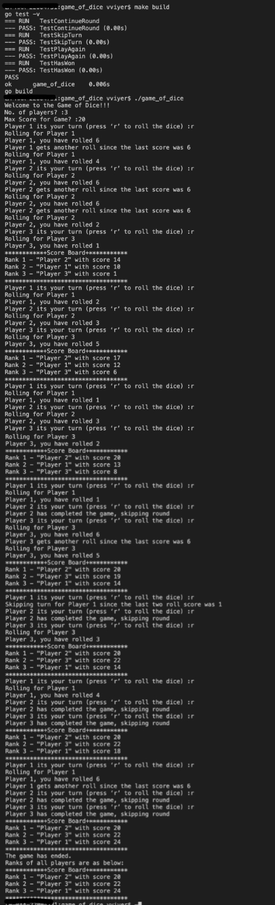

# The-Game-of-Dice
A simple CLI based pass time game for young and old.

# How do I run the code

- Run the command `make install`(probably under construction) to install go in your local, or refer to [go installation docs](https://golang.org/doc/install)
- Run the command `make build` to build the code and generate an executable.
- Alternately, you can download the distribution from the latest tag available [here](https://github.com/Varun2604/game_of_dice/tags)
- Run the built/downloaded executable. 

# Problem statement
The "Game of Dice" is a multiplayer game where N players roll a 6 faced dice in a round-robin
fashion. Each time a player rolls the dice their points increase by the number (1 to 6) achieved
by the roll.
As soon as a player accumulates M points they complete the game and are assigned a rank.
Remaining players continue to play the game till they accumulate at least M points. The game
ends when all players have accumulated at least M points. 
### Rules of the game
- The order in which the users roll the dice is decided randomly at the start of the game.
- If a player rolls the value "6" then they immediately get another chance to roll again and move
ahead in the game.
- If a player rolls the value "1" two consecutive times then they are forced to skip their next turn
as a penalty.
### Implementation Details
- Implement a standalone program in your favorite programming language which takes the
values N (number of players) and M (points of accumulate) as command line arguments.
- Name the players as Player-1 to Player-N and randomly assign the order in which they
will roll the dice.
- When it's the turn for Player-X to roll the dice prompt a message like “Player-3 its your
turn (press ‘r’ to roll the dice)
- Randomly simulate a dice roll, display the points achieved and add the points to the
user’s score.
- Print the current rank table which displays the points of all users and their rank after
each roll.
- If the user gets another chance because they rolled a ‘6’ or they are penalised because
they rolled ‘1’ twice consecutively then print appropriate message on standard output to
inform the user.
- If a user completes the game, print an appropriate message on the output displaying
their rank.

# Solution Implementation

- The game accepts 2 inputs - the count of the players in the game `C`, and the max score for the score board `M`.
- Once the game starts, all players are requested to roll the die (by pressing any key followed by the `return` key)
- The score board is printed at the end of every round.
- The game keeps running till the last person score minimum of `M`.

The code is divided into 3 modules :  
- models - contains 2 models, viz., input and the log which stores the game inputs and the statistics/logs respectively
- utils - contains all the required utilities by all other modules.
- game - the game module contains all the required implementation logic. Functional paradigm is used to write the module.

Sample output is as below :-
